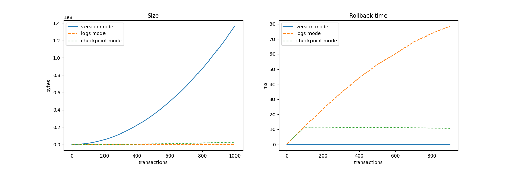

Questions
=========

Requirements: `pip install -r requirements.txt`

1. Implémenter une méthode `rollback_version(self, version: int)` qui retourne la deltatable à la version souhaitée. Une méthode `get_versions()` donnant l'accès à l'objet stockant les versions sera nécessaire.

2. Implémenter une méthode `rollback_transactions(self, number_of_transactions: int)` qui rollback les `n` dernières transactions. Une méthode `get_transactions()` donnant l'accès à l'oject stockant les transactions sera nécessaire.

3. Appliquer la fonction `measure_rollback_time_and_size` pour mesurer les performances mémoire et temporelle de nos différentes implémentations.

4. BONUS: Implémenter une solution compromis à base de checkpoints+logs.
